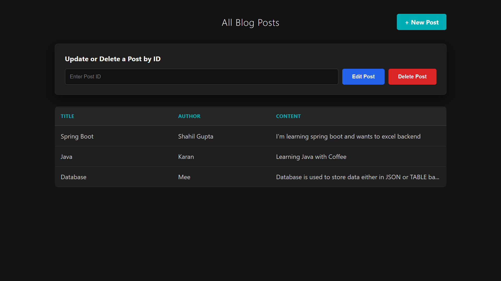
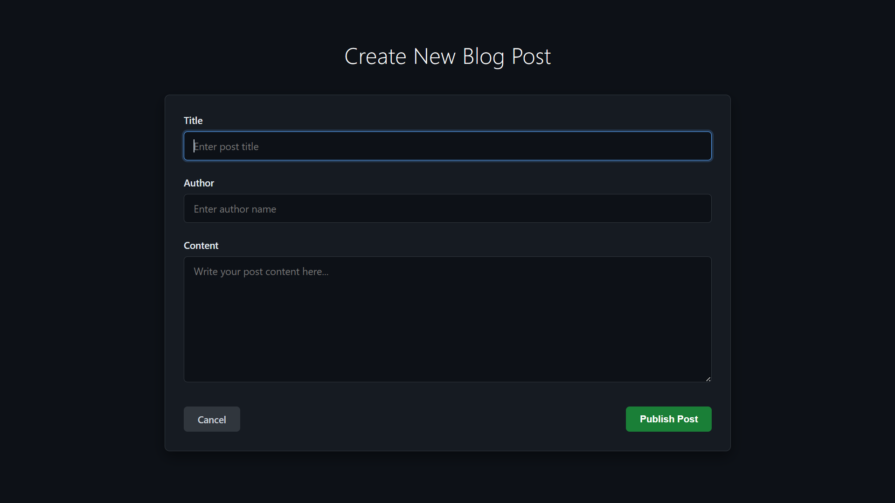

# Spring Boot Blog Platform 📱

[](https://github.com/Shahil-147/spring-boot-blog-platform)
[](https://opensource.org/licenses/MIT)
[](https://www.oracle.com/java/)
[](https://spring.io/projects/spring-boot)

**A high-performance, full-stack blogging engine designed for seamless content management and modern web experiences.**

-----

## 📖 Project Description

The **Spring Boot Blog Platform** is a robust web application built to simplify digital publishing. It leverages the power of the Spring ecosystem to provide a secure, scalable, and responsive environment for creators to manage their content. Designed with a "Professional-First" aesthetic, it features a sophisticated dark-themed UI and efficient server-side rendering.

## ✨ Features

  * **Full CRUD Functionality:** Create, read, update, and delete blog posts with ease.
  * **Dynamic Templating:** Real-time content rendering using Thymeleaf.
  * **Persistent Storage:** Relational data management with ACID compliance.
  * **Responsive UI:** Fully optimized for mobile, tablet, and desktop views.
  * **Modern Aesthetics:** Professional dark-mode interface (Midnight Blue & Charcoal).
  * **Input Validation:** Server-side validation for data integrity.

## 🛠 Tech Stack

| Layer | Technology |
| :--- | :--- |
| **Backend** | Java 17+, Spring Boot 3.x, Spring Data JPA |
| **Frontend** | Thymeleaf, HTML5, CSS3 (Modern Dark Theme), JavaScript |
| **Database** | MySQL |
| **Build Tool** | Maven / Gradle |

## 📂 Project Structure

```text
src/
 ├── main/
 │    ├── java/com/project/blog/
 │    │    ├── controller/    # Web Request Handlers
 │    │    ├── model/         # Database Entities
 │    │    ├── repository/    # Data Access Layer
 │    │    └── service/       # Business Logic
 │    └── resources/
 │         ├── static/        # CSS, JS, and Images
 │         ├── templates/     # Thymeleaf HTML Fragments
 │         └── application.properties
```

## 🚀 Installation & Setup

1.  **Clone the Repository**

    ```bash
    git clone https://github.com/Shahil-147/spring-boot-blog-platform.git
    cd spring-boot-blog-platform
    ```

2.  **Configure Database**
    Update `src/main/resources/application.properties` with your MySQL credentials:

    ```properties
    spring.datasource.url=jdbc:mysql://localhost:3306/blog_db
    spring.datasource.username=your_username
    spring.datasource.password=your_password
    ```

3.  **Build and Run**

    ```bash
    # Using Maven
    ./mvnw spring-boot:run
    ```

4.  **Access the App**
    Open your browser and navigate to: `http://localhost:8080`

## 📡 API Endpoints (Web Routes)

| Method | Endpoint | Description |
| :--- | :--- | :--- |
| `GET` | `/` | Home page / List all posts |
| `GET` | `/post/{id}` | View a single blog post |
| `GET` | `/post/new` | Show create post form |
| `POST` | `/post/save` | Submit new/updated post |
| `GET` | `/post/edit/{id}` | Show edit post form |
| `GET` | `/post/delete/{id}` | Remove a post |

## 📸 Screenshots

| Dashboard (Dark Mode) | Post Editor |
| :--- | :--- |
|  |  |

## 🏗 Future Enhancements

  - [ ] User Authentication & Authorization (Spring Security).
  - [ ] Image Upload integration (AWS S3).
  - [ ] Markdown Support for post creation.
  - [ ] Comment Section & Social Sharing.

## 👨‍💻 Author

**Shahil**

  * **GitHub:** [@Shahil-147](https://www.google.com/search?q=https://github.com/Shahil-147)
  * **Role:** Aspiring Software Engineer | Full Stack Developer

## 📄 License

This project is licensed under the MIT License - see the [LICENSE](https://www.google.com/search?q=LICENSE) file for details.
